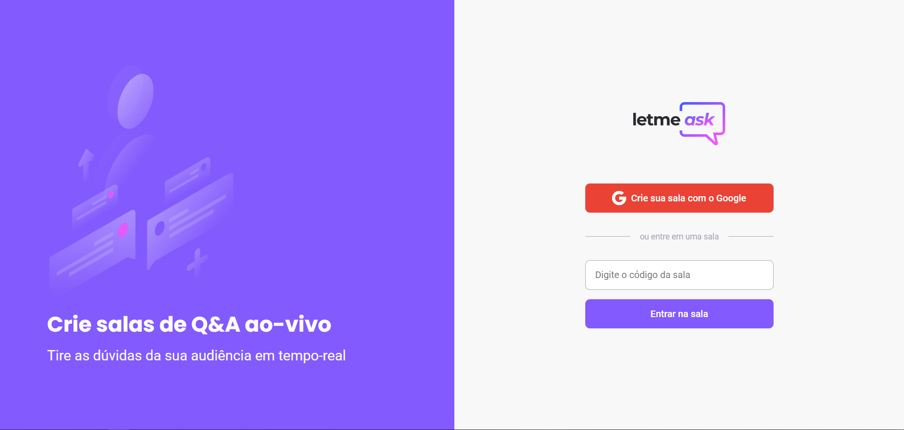

# Letmeask

## 💻 Projeto

App criado durante o NLW together da Rocketseat.

  

<h1 align="center">
    
</h1>

 

## 🧪 Tecnologias

Tecnologias utilizadas no projeto:

- [React](https://reactjs.org)
- [Firebase](https://firebase.google.com/)
- [TypeScript](https://www.typescriptlang.org/)
